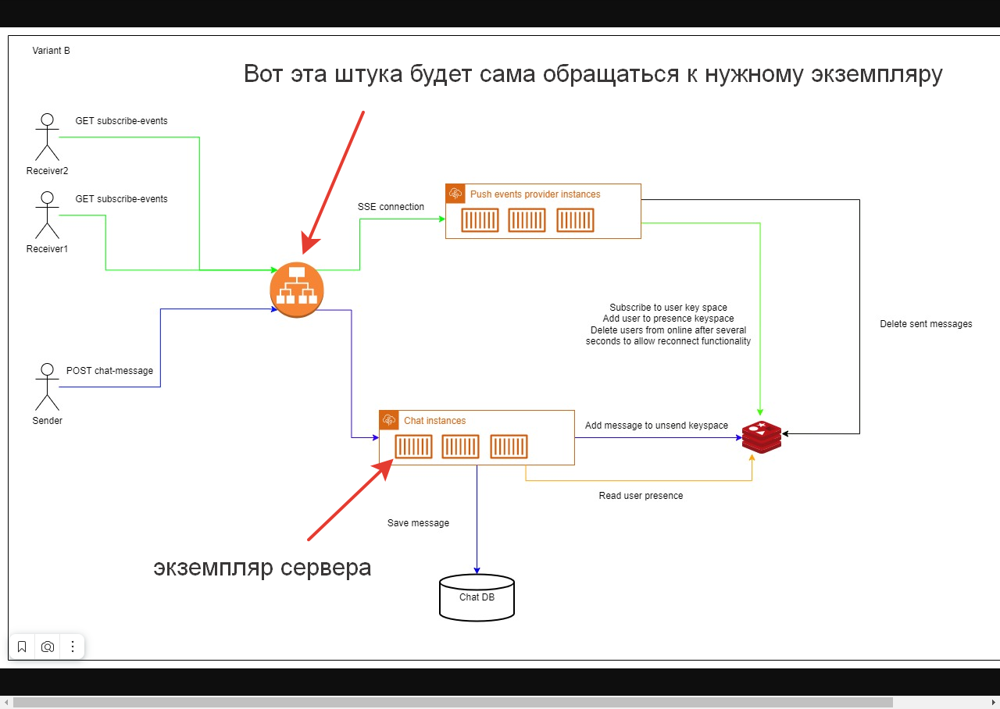

# Домашнее задание №3

В данной работе были были рассмотрены 
основы работы с Redis Cluster и его основными структурами. Ниже предоставлены
статистики среднего времени работы запись/чтение на **dataset** размером **22 МБ**


## String

Строки самые медленные на запись/чтение структура данных,
но взамен мы получаем бинарно-безопасную структуру 
в которой можно хранить значения под 512 МБ

```
AVG time writing: 7.195508432388306 sec.
AVG time reading: 2.4811206817626954 sec.
```

## HSET

Хэш-таблицы в Redis работают не сильно быстрее строк на запись/чтение.


```
AVG time writing: 6.086856412887573 sec.
AVG time reading: 2.469229507446289 sec.
```

## ZADD

Упорядоченное множество - структура в Redis основанная на структуре set.
Главным приемуществом которой, является скорость работы на запись/чтение


```
AVG time writing: 3.2707145690917967 sec.
AVG time reading: 0.009859037399291993 sec.
```


## LIST

Классическая структура данных - список. 

```
AVG time writing: 8.940437984466552 sec.
AVG time reading: 0.0008167743682861329 sec.
```

## Вывод

Были рассмотрены основные типы данных, 
поддерживаемые Redis, такие как строки, списки, 
множества, отсортированные множества и хеш-таблицы. 

Данная практическая работа 
позволила ознакомиться с основами 
работы с Redis и понять, что данная 
система управления базами данных 
может быть очень полезной в различных 
проектах, где требуется быстрый доступ 
к данным и высокая производительность. 
Redis может использоваться в качестве кэша 
для ускорения работы веб-приложений, для 
обмена сообщениями между компонентами 
системы, а также для решения других задач.
Как пример, можно использовать Redis для создания расширяемого чата 

